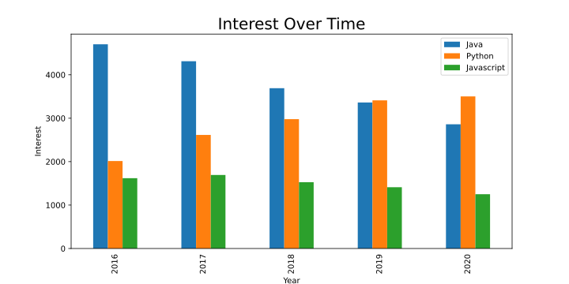

# Visualizing Custom Graphs with Google Trends and Pandas

Perhaps you're interested in utilizing Google trends but find the website rather limiting; with the help of this article you will learn how to create custom graphs using Google trends data.

We will use [Pytrends](https://pypi.org/project/pytrends/)(an unofficial Google trends API), as well as the usual suspects in visualizations: [matplotlib](https://matplotlib.org) and specifically [pandas](https://pandas.pydata.org/docs/getting_started/index.html#getting-started) as they have integrated functionality for matplotlib. This will all be done on [Jupyter Notebooks](https://jupyter.org) with the help of [ReviewNB](https://www.reviewnb.com/) as our source control solution.

This article assumes you have _some_ prior usage of Jupyter notebooks, Github, and matplotlib/pandas.

Let's get started by creating a new notebook.

## Setup and Connecting to Google

Firstly, Let's install the _pytrends_ module:
run `pip install pytrends` on your _anaconda prompt_.
or `!pip install pytrends` on the notebook itself, give it a few seconds and you will see the output once it is done.

Now we can import all the modules we will need with the following code:

```
import matplotlib.pyplot as plt
import pandas as pd
import pytrends
from pytrends.request import TrendReq
```

We will begin by connecting to Google trends using the `TrendReq` class imported from `pytrends.request`.
Enter this code to do so.

```
pytrends = TrendReq(hl='en-US')
```

This initializes our pytrends object and establishes a connection to Google trends. We set the `hl`(host language) to American English.

`It seems Google supplies the data using UTC and so setting the timezone becomes redundant. I even tried non existing timezones and there is still no change in the data.`

### Interest over Time - Bar chart

Now, let's get Google trends data for our first graph. We will get the interest over time for any topic/s we want and plot it onto a bar chart.

Type in the following:

```
kw_list = ["Java", "Python", "Javascript"]
pytrends.build_payload(kw_list, geo='', timeframe='2016-01-01 2020-12-31')
```

We start with building a keywords list of the item/s we want to query (Max allowed: 5).
We then supply `kw_list`(_always required_) as a parameter to the `build_payload` function.
You will notice that a lot of the other pytrends functions do not take any arguments... This is due to them using the built payload,
which is stored within the pytrends object. This payload contains information on the data you are requesting.

- `geo` is the geographic location that we have set to global by using an empty string.
  This is the default behaviour, and so essentially we don't have to specify this.
  Should you need to narrow your payload, you can use the two-letter(_capitilized_) [county code](https://www.iban.com/country-codes).
- `timeframe` is set to `'today 5-y'` by _default_, which means from five years back until today's date. We want coherent results with full years, so we explicitly set the timeframe to `'2016-01-01 2020-12-31'`.

Let's retrieve the 'interest over time' data with:

```
time_interest = pytrends.interest_over_time()
del time_interest['isPartial']
```

The `interest_over_time()` method is one of the options available with pytrends, which return a pandas dataframe.
We also delete the `isPartial`(boolean) column from our dataframe as it signifies whether or not the data is complete; We won't need to plot this.
You can run `time_interest.head()` to see what kind of data we're working with.

Now you can directly plot this data using `time_interest.plot()`, and you will see something similar to that on the Google Trends website.
That is not our goal in this article, so let's continue and customise our plot.

Enter the following code:

```
time_interest = time_interest.groupby(pd.Grouper(freq='Y')).sum()

ax = time_interest.plot(kind='bar', xlabel='Year', ylabel="Interest", figsize=(10, 5))
ax.set_xticklabels([pandas_datetime.strftime("%Y") for pandas_datetime in time_interest.index])
ax.set_title('Interest Over Time', fontsize=20)
ax.xaxis.set_ticks_position('none')
```

- As we are aiming to plot a bar chart, we use `groupby` to make sure all the data is aggregated(grouped) by our specified `pd.Grouper`, which we have chosen as years(`freq='Y'`). This function operates on the index of our dataframe, which in this case are the dates.
  Add `sum()` at the end to ensure that the data is aggregated and visualized on one plot instead of separate plots, each with their own years.
- `time_interest.plot()` would return a subplot(or np.array, we'll encounter this in the next graph) which we can further process using matplotlib. So we assign our plot to a variable so we can do just that.
- We plot our `time_interest` graph as a bar chart with `kind = 'bar'`(Pandas' `.plot()` method and it's arguments are explained [here](https://pandas.pydata.org/pandas-docs/version/0.15/generated/pandas.DataFrame.plot.html)). Set the figsize to `(10, 5)` (tuple: (_width_, _height_) in inches)).
- Use `set_xticklabels()` with list comprehension to get only the years from our dataframe(else it includes the month, day, and time which we don't need) as labels on the x-axis. Alternatively, you could just as well use `['2016','2017','2018','2019',..]`.
- Finally, we set the title for our graph using `set_title` and use `ax.xaxis.set_ticks_position('none')` to remove the xticks report we would otherwise get on the graph.

Your graph should look something like _this_.

Save your notebook file before continuing.

### Github

With our first graph done, let's go ahead a check our notebook into Github for safe storage for now.
Push your notebook onto a new repo in Github using the standard way through your terminal, you will see why shortly.

```
git init
git add -A
git commit -m "first commit"
git branch -M main
git remote add origin <Your Github repo>
git push -u origin main
```

## Interest by Region - Pie chart

With our notebook safely checked in, let's go ahead and create another graph below our first one.
This time we'll create a pie chart showing the regions with the highest interest in a topic.

Type in the following code:

```
kw_list = ["stack overflow"]
pytrends.build_payload(kw_list)

regions = pytrends.interest_by_region()
regions = regions.sort_values(kw_list[0], ascending=False)[:15]
regions.head()
```

- Once again, we start by defining a keyword list and building a payload from it,
  however, this time we'll use one query to visualize one pie chart.
- We call `pytrends.interest_by_region()` to get our regional data in a pandas dataframe, which we then sort in descending order
  (first column `kw_list[0]` which contains all the values, with `ascending=False`) taking only the top 15 regions interested in our specified topic "stack overflow".
- You can run `regions.head()` to see the data we're working with again(Don't forget to rerun your notebook from the top in case you closed it earlier).

Now that we have our data ready, let's plot it using:

```
ax = regions.plot(kind = 'pie', figsize=(10, 10), subplots=True, legend=False)
ax = ax.flatten()[0]
ax.set_title('Interest by Region', fontsize=20)
ax.xaxis.set_ticks_position('none')
```

You'll notice that we use very similar code as before to plot our pie chart, with the major differences being:

- `kind = 'pie'` to specify we want a pie chart.
- `subplots=True` enables us to plot the chart without having a y-column in our data(usually required for pie charts).
- `legend=False` to remove the extra legend as the pie slices are already named with the region.
- Our pie chart, requiring two columns has returned a two-dimensional np.array. We then use `ax.flatten()[0]` to collapse the np.array into one dimension so we can further process it as a subplot.
  After flattening, we can then set the title(not possible without flattening) and remove the xaxis ticks report as before.

You should have a graph similar to _this_, which provides an interesting take on the regional interest on a topic.


### Github diffs

With another graph done, let's save our notebook and commit it to the Github repo, pushing the changes we've added.

```
git commit -a -m "Added regional interest pie chart"
git push
```

Let's quickly review the changes on Github's website.
On your repo, open the latest change we've made on the notebook and click on 'load diff'.

_A lot_ of JSON pops up showing the almost minor changes we've added.
This _is_ a headache. Fortunately, we have a handy tool to let us review the changes we have made.

## ReviewNB

[ReviewNB](https://www.reviewnb.com/) is a Github app specifically dealing with visual diffs and comments on notebooks.
Go ahead and create an account for free if you have not already.

After authorizing the app and allowing it repository access to our current repo,
you should be redirected to the app's [home page](https://app.reviewnb.com/).
From here, let's select our repo and then the latest commit underneath the `Commits` tab.
Opening the notebook file, we should be greeted with something like _this_.

This is _not_ a headache. Now we can see exactly what we have changed on our notebook.

## Interest over Time - KDE plot

With our version control issue solved,
let's create one final custom Google trend graph. This one will be a Kernel Density Estimation plot derived from our first
graph.

Before we begin, let's create and checkout another branch(You will see why shortly) on the repo using:

```
git branch WIP
git checkout WIP
```

Now, we'll use much of our first bar chart code with a little modification.
This is what it should look like:

```
kw_list = ["Java", "Python", "Javascript"]
pytrends.build_payload(kw_list, timeframe='2016-01-01 2020-12-31', cat=0, gprop='')
interest = pytrends.interest_over_time()
interest.head()
```

You'll notice that we've added two new arguments to the `build_payload` function.
Namely `cat=0`(we don't want any categories to narrow the results) and `gprop`(Google property filter, examples: `youtube`, `images`, `news`, etc.), again, this is all default behaviour. Check the [api](https://pypi.org/project/pytrends/) for more details.

Now it's time to visualize our density plot, which we will do using the following code:

```
ax = interest.plot(kind='density', figsize=(10, 10))
ax.set_xticks([])

ax.set_title('KDE Plot (Density of interest over Time)', fontsize=20)
ax.set_xlabel('2016 - 2020', fontsize=12)
ax.set_ylabel('Interest density', fontsize=12)
ax.xaxis.set_ticks_position('none')
```

This time we do not aggregate the data as we will need to use all the points on the density plot and we can leave the `isPartial` column in-place as it will not get plotted on this particular plot. A few other changes are:

- `kind='density'` to indicate we want a density plot, you could also use `'kde'`.
- We will remove the x axis values by using `set_xticks([])` as the values end up being rather hard to work with(especially when trying to correlate them with the years)
- Notice that we do not set the x and y labels within the `.plot()` method but rather `ax.set_xlabel()` and `ax.set_ylabel()`. This is to show that you can use this alternative technique in case you run into issues where the x label does not show even though you have defined it inside `.plot()`.

You can then run the code and you will get something similar to _this_.

It is interesting to view the spike in JavaScript interest in this manner.

## Pull Requests

Let's create a pull requests scenario for ourselves as this will help us familiarize the Github workflow.

Save your notebook and push it into the new branch we created using:

```
git commit -a -m "added a density plot"
git push -u origin WIP
```

We have successfully pushed the new plot to our secondary branch.
From here, let's open Github and you should see "WIP had recent pushes less than a minute ago". Click on the `Compare and pull request` button; the next screen will allow you to write a comment and create a pull request.

After doing so, The `Conversation` tab will be opened in which you can have a discussion as per usual about the pull request you just created.
You will notice that `review-notebook-app`bot has commented with a link to view our pull request on ReviewNB, lest we want to revive JSON dragon let's click on that link.

The link takes us to the `Changes` tab on ReviewNB which we can also get to via the normal [app route]('https://app.reviewnb.com/') and then selecting the `Pull requests` tab. From there we can see the changes we've added and even add a comment on certain lines if we need to get clarification or provide feedback. Let's post a comment on the new graph, I've posted "**Could you lower the graph height to 60% - 75% of what it is perhaps? there's too much open space**".
We can now see our comment on the `Discussion` tab, and if we head back to Github, we will see the same thing in `Conversation`.

Finally, we can resolve the conversation and merge our WIP branch to main; this concludes the article.

#

Possible Issues:

- It is possible to be rate limited when making excessive requests with the [pytrends api](https://pypi.org/project/pytrends/). Have a look at the `Connect to Google` section for a remedy.

In this article you have learnt how to create a few custom graphs using freely available data from Google trends(through an unofficial api)
with a tool like ReviewNB to see visual diffs on your notebooks.

Have a look at matplotlib's [gallery](https://matplotlib.org/stable/gallery/index.html) for more plot examples as well as [kaggle]('https://www.kaggle.com/datasets') which also offers numerous open datasets.
